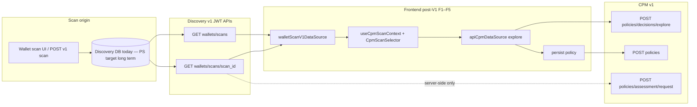

# CPM Option A — Integrated narrative (Discovery v1 ↔ CPM v1 ↔ frontend)

**What is Option A?** Option A is the **post-V1 CPM integration path**: connect the Crypto Policy Management experience to **real authenticated wallet scans** through the **Discovery backend** (data stored via Persistence Service / DB today—Discovery is not DB-free yet). The frontend must not call the database or an unauthenticated Persistence Service; CPM consumes normalized scan context from Discovery HTTP APIs. **Option B** (later) would front scan data with an extracted Persistence Service boundary; Option A is the deliberate short-term choice aligned with existing AuthN/AuthZ in Discovery. Product definition and intended flows: [`workplans/CPM_post_v_1_option_a_scan_context.md`](../workplans/CPM_post_v_1_option_a_scan_context.md).

End-to-end product and integration story for **Option A** (reconciled with **v1** APIs): authenticated wallet scans from **Discovery v1**, synchronous policy preview via **CPM explore**, optional **persist**, and a separate **async assessment** path. This document is the **integrated** entry point after the multi-repo PR sequence (**A1–C2**, **F1–F5**, **D1**); it does not replace normative contracts.

| Role | Document / artifact |
|------|---------------------|
| **Option A definition (product / architecture)** | [`workplans/CPM_post_v_1_option_a_scan_context.md`](../workplans/CPM_post_v_1_option_a_scan_context.md) |
| Merged API PR index | [`workplans/WORKPLAN_API_PR.md`](../workplans/WORKPLAN_API_PR.md) |
| Stable API narrative | [`workplans/WORKPLAN_API.md`](../workplans/WORKPLAN_API.md) |
| Option A PR plan (tracking) | [`workplans/CPM_OPTION_A_PR_PLAN.md`](../workplans/CPM_OPTION_A_PR_PLAN.md) |
| Frontend V1 + post-V1 F\* | [`workplans/CPM_FRONTEND_PR_PLAN_V1.md`](../workplans/CPM_FRONTEND_PR_PLAN_V1.md) |
| Maintainer mapping (A2) | [Discovery `CPM_OPTION_A_DISCOVERY_V1_CONTRACT.md`](https://github.com/create2-labs/cafe-discovery/blob/main/docs/CPM_OPTION_A_DISCOVERY_V1_CONTRACT.md) |
| Public developer guide | [CAFE `03-cafe-developer-guide.md`](https://github.com/create2-labs/cafe-documentation/blob/main/03-cafe-developer-guide.md) |
| Option A architecture (public) | [CAFE `docs/architecture/cpm-option-a-v1-flow.md`](https://github.com/create2-labs/cafe-documentation/blob/main/docs/architecture/cpm-option-a-v1-flow.md) |
| Discovery OpenAPI | [`cafe-discovery/openapi/discovery-v1.yaml`](https://github.com/create2-labs/cafe-discovery/blob/main/openapi/discovery-v1.yaml) |
| CPM OpenAPI | [`openapi/cpm-v1.yaml`](../openapi/cpm-v1.yaml) |

**Historical (removed public route):** la façade policy-context historique was an interim façade ([Discovery #48](https://github.com/create2-labs/cafe-discovery/pull/48)) and was **removed** in favor of v1 list/detail ([Discovery #54](https://github.com/create2-labs/cafe-discovery/pull/54) — **PR11a**). Do not document or implement it as an active integration path.

---

## 1. System flow (data ownership)

Today, wallet scan rows and renderable **`result`** payloads live in **Discovery’s database** (interim). **Persistence Service** is the long-term authoritative owner for scan artifacts; Discovery remains the **HTTP owner** for list/detail until that migration completes. CPM never reads Discovery SQL; the frontend never calls Persistence Service or SQL directly.



**Correlation key:** `scan_id` (UUID) threads list, detail, explore, persist (`binding=discovery`), `GET /api/cpm/v1/policies?scan_id=`, and Discovery **DELETE** (409 when CPM reports a policy reference).

---

## 2. URL matrix (direct backend vs edge)

Ingress strips **`/api`** before traffic reaches service listeners. Browsers and edge scripts use the **edge** column; local `go run` / compose often use **direct** Discovery paths on `:8080` and CPM on `:8082`.

### Discovery — wallet scans (owner JWT)

| Capability | Discovery backend | Typical edge |
|------------|-------------------|--------------|
| List synopsis | `GET /discovery/v1/wallets/scans` | `GET /api/discovery/v1/wallets/scans` |
| Detail by `scan_id` | `GET /discovery/v1/wallets/scans/{scan_id}` | `GET /api/discovery/v1/wallets/scans/{scan_id}` |

List envelope: `{ total, limit, offset, items }` (`ScanListItem`). **Not** legacy `{ contexts: [...] }`.

### CPM — explore, persist, list, assessment

| Capability | CPM in-process path | Typical edge |
|------------|---------------------|--------------|
| Sync explore (**`policy_context` required**) | `POST /cpm/v1/policies/decisions/explore` | `POST /api/cpm/v1/policies/decisions/explore` |
| Persist policy (`binding` rules) | `POST /cpm/v1/policies` | `POST /api/cpm/v1/policies` |
| List policies for scan | `GET /cpm/v1/policies?scan_id=` | `GET /api/cpm/v1/policies?scan_id=` |
| Async assessment (**`policy_context` forbidden**) | `POST /cpm/v1/policies/assessment/request` | `POST /api/cpm/v1/policies/assessment/request` |

**Edge hardening:** `/api/internal/*` must stay blocked at the gateway (**403**) — see `WORKPLAN_API_PR.md` PR9 / PR11b.

Full field-level mapping **v1 detail → `policy_context`**: Discovery A2 doc **§3.1**; golden tests: CPM `internal/contract` ([#35](https://github.com/create2-labs/cafe-crypto-policy-mgt/pull/35)).

---

## 3. Explore vs assessment (do not conflate)

| | **Explore** (sync preview) | **Assessment request** (async) |
|---|---------------------------|----------------------------------|
| Route | `POST …/policies/decisions/explore` | `POST …/policies/assessment/request` |
| Client sends | `scan_id` (optional but typical), **`policy_context`**, **`selection_request`** | **`scan_id`**, **`selection_request`** only |
| **`policy_context`** | **Required** — built from v1 **detail** (`WalletScanDetail` / nested `result`) | **Must not** be sent — **400** if present |
| Observation source | Client-supplied context parsed by CPM (`explore_policy_context.go`) | CPM reloads wallet detail from Discovery (**PR13g** [#33](https://github.com/create2-labs/cafe-crypto-policy-mgt/pull/33)) |
| Persist / NATS | No persist; no assessment pipeline | **202** + `policy.assessment.requested.v0.1` |
| Frontend (F4) | `explorePolicyContext.ts` from selected scan detail | Separate product flow; not the CPM page explore path |

---

## 4. Frontend wiring (post-V1 F1–F5, merged)

| PR | Repo | Deliverable |
|----|------|-------------|
| F1 [#58](https://github.com/create2-labs/cafe-frontend/pull/58) | cafe-frontend | `createWalletScanV1DataSource()` — list + detail HTTP only |
| F2 [#59](https://github.com/create2-labs/cafe-frontend/pull/59) | cafe-frontend | `useCpmScanContext()` — selection, `?scanId=`, rejects placeholder as real scan |
| F3 [#60](https://github.com/create2-labs/cafe-frontend/pull/60) | cafe-frontend | `CpmScanSelector` on Crypto Policy Management |
| F4 [#61](https://github.com/create2-labs/cafe-frontend/pull/61) | cafe-frontend | Real `scan_id` + v1 `policy_context` on explore; no `mock-discovery-scan-placeholder` in API payloads after selection |
| F5 [#62](https://github.com/create2-labs/cafe-frontend/pull/62) | cafe-frontend | `cpmOptionAFlow.e2e.spec.ts` — Vitest + mocked transport |

V1 baseline (**PR 12** API `CpmDataSource`, validation, EOA, persist) remains in [`CPM_FRONTEND_PR_PLAN_V1.md`](../workplans/CPM_FRONTEND_PR_PLAN_V1.md). **`mock-discovery-scan-placeholder`** is **mock-mode only** until the user picks a real scan.

---

## 5. Backend milestones (merged)

| Track | PRs | Summary |
|-------|-----|---------|
| Discovery v1 surface | [#49](https://github.com/create2-labs/cafe-discovery/pull/49), [#52](https://github.com/create2-labs/cafe-discovery/pull/52), [#54](https://github.com/create2-labs/cafe-discovery/pull/54) | OpenAPI + list/detail; legacy contexts route removed |
| A2 contract doc | [#60](https://github.com/create2-labs/cafe-discovery/pull/60) | Maintainer v1 ↔ CPM mapping |
| CPM explore | [#29](https://github.com/create2-labs/cafe-crypto-policy-mgt/pull/29) | Option A `policy_context` |
| CPM persist / list | [#28](https://github.com/create2-labs/cafe-crypto-policy-mgt/pull/28) | `scan_id`, `binding`, `GET ?scan_id=` |
| CPM assessment | [#33](https://github.com/create2-labs/cafe-crypto-policy-mgt/pull/33) | Wallet-only async; no client `policy_context` |
| C1 smoke script | [#34](https://github.com/create2-labs/cafe-crypto-policy-mgt/pull/34) | [`test-discovery-v1-wallet-scans-to-cpm.sh`](https://github.com/create2-labs/cafe-deploy/scripts/test-discovery-v1-wallet-scans-to-cpm.sh) |
| C2 contract tests | [#35](https://github.com/create2-labs/cafe-crypto-policy-mgt/pull/35) | Golden A2 §3.1 |

---

## 6. Smoke script (C1)

Active bash smoke (v1 only):

```bash
cd cafe-crypto-policy-mgt
export DISCOVERY_EMAIL='user@example.com' DISCOVERY_PASSWORD='secret'
# Direct backends (defaults): DISCOVERY_BASE=http://localhost:8080 CPM_BASE=http://localhost:8082
SKIP_PERSIST=1 ./scripts/test-discovery-v1-wallet-scans-to-cpm.sh
```

- **Flow:** sign-in → `GET /discovery/v1/wallets/scans` → `GET …/wallets/scans/{scan_id}` → `POST /api/cpm/v1/policies/decisions/explore` → optional `POST /api/cpm/v1/policies`.
- **Edge:** set `DISCOVERY_V1_WALLET_SCANS_LIST_PATH=/api/discovery/v1/wallets/scans` and point `DISCOVERY_BASE` / `CPM_BASE` at the gateway host (see script `--help`).
- **Removed scripts (do not restore):** `test-discovery-wallet-contexts-to-cpm.sh`, `test-wallet-scan-and-cpm-policy.sh` (CBOM polling / `façade policy-context (retirée)`).
- **CI:** `bash -n scripts/test-discovery-v1-wallet-scans-to-cpm.sh` in [`.github/workflows/ci.yml`](../.github/workflows/ci.yml).

---

## 7. Manual validation (quick)

```bash
cd cafe-discovery && GOWORK=off go test ./... -count=1
cd cafe-crypto-policy-mgt && GOWORK=off go test ./... -count=1
cd cafe-frontend && npm test && npm run typecheck && npm run lint
bash -n cafe-crypto-policy-mgt/scripts/test-discovery-v1-wallet-scans-to-cpm.sh
```

Optional regression check (scripts only; `*.md` may mention historical paths):

```bash
grep -R "façade policy-context (retirée)" cafe-crypto-policy-mgt/scripts --include='*.sh' -n || true
```

---

## 8. Non-goals (Option A initiative)

- Reintroducing la façade policy-context historique as a nominal public API.
- Frontend or CPM direct access to Persistence Service / Discovery SQL.
- Big-bang removal of Discovery DB before PS ingestion is ready.
- Playwright E2E for this path (F5 uses Vitest + mocked HTTP).
