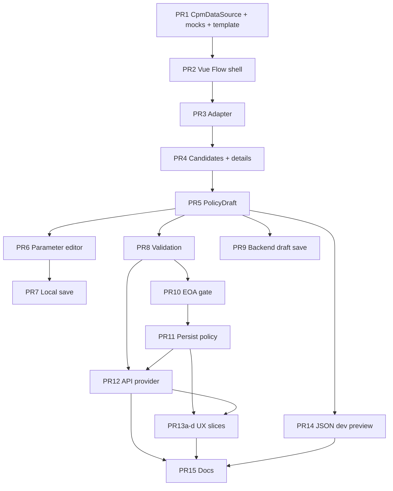

# CPM Frontend — PR Plan V1

This document is the multi-PR plan for CPM (Crypto Policy Manager) frontend work. It keeps architecture invariants stable while sequencing implementation so the UI grows from **`CpmDataSource`**, through a locked **Vue Flow** viewer and **feature PRs**, **`PolicyDraft`**, optionally **backend draft save (PR 9)** (including **before** authoritative validation when product rules allow **non-actionable WIP** on the server), **authoritative validation (PR 8)**, **EOA-gated persisted policy (PR 11)**, then **API swap** and split **UX hardening**. **PR 11** always requires **successful authoritative validation**; **PR 9** does **not**, unless eligibility rules explicitly demand it (**§6**, PR 9 **Dependencies**).

**Sources of truth for contracts:** `CPM_FUNCTIONAL_SPEC_V1.md`, `CPM_TECHNICAL_SPEC_V1.md`. If this plan contradicts those specs, the specs win; capture gaps in repo issues or an appendix, not by quietly changing norms here.

**Statut plan V1 (frontend) :** séquence **PR 1–15 complète** — dernière livraison **PR 15** mergée dans [cafe-frontend PR #53](https://github.com/create2-labs/cafe-frontend/pull/53) (2026-05-15). Les évolutions ultérieures relèvent du backlog §10 ou d’un plan V2, pas de ce document.

Pour chaque PR tu dois creer une branche locale dans le repo concerne, implementer, faire les tests (e.g npm audit) et proposer les messages pour les commit et les PR

---

## 1. Objectives

- Deliver a **CPM page** that is a rendering and editing **client only**: topology and policy truth live on the backend.
- Use **Vue Flow** as a **locked graph viewer** (not a topology editor), fed exclusively by **`PolicySelectionResponse`** (including **`graphEdges`**).
- Progress in **small, reviewable PRs** with clear acceptance criteria, tests, and explicit non-goals.
- Introduce **early template selection**, a single **`CpmDataSource`**, and **no direct fixture imports in UI components**.

---

## 2. Non-goals (phase / product)

- **Remediation execution** (out of scope for this V1 plan unless product reopens it with a bounded API).
- **Authoritative policy engine on the frontend** (no client-side compatibility compilation beyond display and allowed edits).
- **Hardcoded graph compatibility rules** or **topology inferred from node order** — topology comes only from **`graphEdges`** as returned by CPM.
- **Free-form graph editing**: moving nodes, creating/deleting/rewiring edges, or replacing Vue Flow with a custom renderer for policy topology.
- **Final backend implementation internals** — only the contract shapes and HTTP boundaries assumed by this plan.

---

## 3. Architecture constraints (invariant across all PRs)

- **Vue Flow is a locked viewer**, not an editor: no user-driven topology authoring.
- **Nodes are not draggable** (except if the library requires internal flags; product intent is no layout manipulation by the user).
- **Edges are not editable or connectable** in the UI.
- **Graph topology comes only from** `PolicySelectionResponse.graphEdges` (and companion response fields per the technical spec). The frontend **must not infer** edges from node ordering.
- The **frontend must not become a policy engine**.
- **Backend validation remains authoritative**; any local checks are **UX-only** and clearly non-normative.
- **`CpmDataSource` is the single data-access abstraction** for selection, validation, backend draft save, policy persist, template listing, and related calls **as they appear in spec** (distinct operations — **never** fold **backend draft** into **persisted policy** client-side). After the mock provider exists, **UI components must not import fixtures directly**.

---

## 4. Core abstractions

### `CpmDataSource`

| Implementation (phase) | Role |
|------------------------|------|
| **Mock / fixture provider** | Returns `PolicySelectionResponse`, validation outcomes, and other CPM-shaped results per interface; loads fixtures **inside the provider**, not in views. |
| **API-backed provider** | HTTP implementation; same interface (PR 12). |

**Rules:**

- Pages and graph components depend on **`CpmDataSource`** (or a thin composable/store fed by it), **not** on `import … from 'fixtures/…'` in UI layers.
- **Validation**, **backend draft**, **validated policy persistence**, and **template-driven refresh** go through this abstraction so swapping mock → API does not rewrite the feature layer.

### Vue Flow shell vs CPM → Vue Flow adapter

| Concern | Where it lives |
|---------|----------------|
| **Viewer shell** (PR 2) | Vue Flow mount, zoom/pan/fit-view, **locked** interaction flags, viewport chrome. **No** `PolicySelectionResponse` → graph element mapping. |
| **Strict adapter** (PR 3) | Sole owner of mapping `PolicyNodeInstance` / `PolicyGraphEdge` → Vue Flow nodes/edges; **ids** map to CPM `nodeId` / `edgeId`; layout positions are **display-only**. |

**PR 2 must not** introduce throwaway “temporary” CPM mapping that PR 3 would replace; use an empty graph, or a **non-semantic** minimal static demo **local to the shell** only if needed for viewport smoke tests — **never** wired from fixtures in components.

**Semantic node/edge visuals (badges, reasons):** Custom Vue Flow node and edge components **may be introduced whenever they serve selection, details, or draft UX** (for example alongside **PR 4** onward). **`PR 13d` is final polish** (typography, contrast, legends, minimap tweaks, CAFE alignment) — not the **first** point at which semantic badges or textual reason chrome become **possible**.

---

## 5. Revised PR sequence

PR numbers are **semantic order**. Branch naming is up to the team.

For each PR below: **Goal**, **Scope**, **Acceptance criteria**, **Explicit non-goals**, **Suggested tests**, **Dependencies**.

### Tableau de suivi — état des PR

Tenir cette table à jour au fil des merges (branche locale, lien GitHub/GitLab, PR review / CI).

**Légende statuts :** **À faire** — pas encore de branche / travail pas commencé · **En cours** — développement actif · **PR ouverte** — review en cours · **Mergée** — intégrée sur la branche cible.

_Dernière mise à jour du tableau : 2026-05-15 — plan V1 frontend clos (PR 15 → cafe-frontend #53)._

_Note 2026-05-05 (petite modif avant suite du plan) : la route CPM `/crypto-policy-management` est désormais protégée par `requiresAuth` dans le routeur frontend, avec redirection vers `SignIn` (et `redirect` query) via le guard global, aligné avec le comportement des pages de scan._

| PR | Titre court | Branche | Lien PR | Statut | Notes |
|:---:|-------------|---------|---------|:------:|-------|
| 1 | `CpmDataSource`, mock, sélecteur de template | `cpm/pr-1-cpm-datasource-fixtures-selector` | [PR #34](https://github.com/create2-labs/cafe-frontend/pull/34) | Mergée | Mock/fixtures-only, `useCpmPolicySelection`, `/crypto-policy-management` (désormais protégée auth), Vitest, ESLint. |
| 2 | Shell Vue Flow (canvas verrouillé) | — | — | Mergée | `PolicyGraph.vue`, `policyGraphViewerConfig.ts` ; canvas verrouillé (pan/zoom ; pas d’édition topologique). À lier à une PR dédiée si l’historique Git le distingue. |
| 3 | Adaptateur CPM → Vue Flow | — | — | Mergée | `cpm/graph/cpmToVueFlowAdapter.ts` — topologie depuis `graphEdges` uniquement ; `mergePolicyNodeInstancesForViewer` exporté pour fusion déterministe cross-candidats. |
| 4 | Sélection de candidats + panneau détails | `cpm/pr-4-candidate-selection-details` | [PR #36](https://github.com/create2-labs/cafe-frontend/pull/36) | Mergée | `useCpmCandidateUi`, cartes candidats, `CpmSelectionDetailsPanel`, surlignage chemin (`nodeInstances` / `edgeIds`), inspection nœud/arête (raisons en texte), `policyGraphDisplay.ts` + tests Vitest. |
| 5 | Construction `PolicyDraft` | `cpm/pr-5-policy-draft-construction` | [PR #37](https://github.com/create2-labs/cafe-frontend/pull/37) | Mergée | `policyDraft.ts` (builder pur), `usePolicyDraft.ts`, `DraftStatus` / `PolicyDraft` dans `types.ts`, `CPM_SELECTION_CONTEXT_SCAN_ID` + `selectionScanId` dans `useCpmPolicySelection`, `CpmDraftSummary.vue` sur Crypto Policy Management, tests (`policyDraft.spec`, `usePolicyDraft.spec`, `CpmDraftSummary.spec`). Pas d’aperçu JSON dev (PR 14) ; édition des paramètres en PR 6. |
| 6 | Édition des paramètres de nœud | `cpm/pr-6-node-parameter-editor` | [PR #38](https://github.com/create2-labs/cafe-frontend/pull/38) | Mergée | `CpmNodeParameterEditor`, `updateNodeParameterValues` / réconciliation dans `usePolicyDraft`, validation UX locale (`parameterConstraints`, `parameterLocalValidation`, `jsonParameterValue`), typage `JsonParameterValue` + alignement `CPM_TECHNICAL_SPEC_V1.md`, panneau détails + tests Vitest. |
| 7 | Brouillon local save / reload | — | [PR #39](https://github.com/create2-labs/cafe-frontend/pull/39) | Mergée | `localPolicyDraftStorage.ts`, `useLocalPolicyDraftStorage.ts`, `applyLocalStoredParameters` / `hasParameterEdits` dans `usePolicyDraft`, `CpmLocalDraftPersistence.vue` ; reload safe (schémas, confirm) ; à revoir compat restore avec ids API (**PR 12**). Tests Vitest. |
| 8 | Validation autoritaire | `cpm/pr-8-authoritative-validation` | [PR #40](https://github.com/create2-labs/cafe-frontend/pull/40) | Mergée | `validatePolicyDraft` sur `CpmDataSource`, `usePolicyValidation`, `CpmPolicyValidation.vue`, overlay `draftStatus` validated / validation_failed ; mock défaut shallow + scenario test `rejectWellFormedDraft` — voir note mock défaut / PR9–PR11 dans la section **PR 8** ci-dessous. |
| 9 | Sauvegarde brouillon backend | — | [PR #41](https://github.com/create2-labs/cafe-frontend/pull/41) | Mergée | `savePolicyDraft` sur `CpmDataSource`, mock, `useBackendDraftSave`, `CpmBackendDraftPersistence`, `draftStatus` server_draft, tests. |
| 10 | Passerelle défi EOA | `cpm/pr-10-eoa-challenge-gate` | [PR #42](https://github.com/create2-labs/cafe-frontend/pull/42) | Mergée | `startWalletChallenge` / `verifyWalletChallenge`, `useWalletChallengeGate`, `WalletChallengeGate`, `walletChallengeEligibility` (UNKNOWN mock vs API), gate persist PR11, tests. |
| 11 | Persistance politique validée | `cpm/pr-11-persist-validated-policy` | [PR #44](https://github.com/create2-labs/cafe-frontend/pull/44) | Mergée | Persistance via `CpmDataSource.persistCryptoPolicy`, gate validation autoritaire + EOA (si requis), métadonnées `PersistedCryptoPolicy`, tests. |
| 12 | `CpmDataSource` backed par API | `cpm/pr-12-api-backed-cpm-data-source` | [PR #45](https://github.com/create2-labs/cafe-frontend/pull/45) | Mergée | `createApiCpmDataSource`, `createCpmDataSourceFromConfig`, `VITE_CPM_DATA_SOURCE` / `VITE_CPM_API_BASE_URL`, `CpmDataSourceError`, tests Vitest. |
| 13a | Layout responsive mobile | `cpm/pr-13a-responsive-mobile` | [PR #47](https://github.com/create2-labs/cafe-frontend/pull/47) | Mergée | Onglets Workspace / Policy graph sous breakpoint `lg`, grille 2 colonnes dès `lg`, `min-w-0` et sélecteurs pleine largeur, graphe `dvh` et contrôles Vue Flow en haut sur étroit, `data-testid` + test Vitest. |
| 13b | Accessibilité, clavier, tactile | `cpm/pr-13b-a11y-keyboard` | [PR #48](https://github.com/create2-labs/cafe-frontend/pull/48) | Mergée | Statuts nœuds textuels + `aria-label` ; région graphe + instructions ; `CpmTopologyKeyboardNav` (liste native) ; glosses `uiState` panneau détails ; `aria-busy` / `aria-describedby` validation-persist ; onglets `aria-controls` ; paramètres « Local check » explicite ; tests Vitest. |
| 13c | Erreurs, retry, réseau | `cpm/pr-13c-errors-retry` | [PR #49](https://github.com/create2-labs/cafe-frontend/pull/49) | Mergée | `boundaryFailureStep` + `retryPrimaryCpmFetch` vs `reloadCpmShell` ; retry boundary pour tout sauf recovery sign-in (`cpmBoundaryShowRetryActions`) ; panneaux validation / persist / backend draft avec copy POST + boutons retry ; `aria-busy` section template ; tests Vitest. |
| 13d | Polish visuel et lisibilité du graphe | `cpm/pr-13d-graph-polish` | [PR #50](https://github.com/create2-labs/cafe-frontend/pull/50) | Mergée | Légende Base / Path / Inspected (`id`, `data-testid`, `aria-describedby`) ; arêtes base `var(--text-muted)` + `markerEnd` ; surbrillance path / inspection `var(--warning)` / `var(--primary)` ; grille fond Vue Flow ; `CpmFlowPreviewNode` tokens thème ; tests Vitest. |
| 14 | Aperçu JSON draft (debug / dev) | `cpm/pr-14-draft-json-debug` | [PR #51](https://github.com/create2-labs/cafe-frontend/pull/51) | Mergée | Panneau `<details>` sous le workspace CPM ; gate `import.meta.env.DEV` ou `VITE_CPM_DRAFT_JSON_DEBUG` (`true`/`1`) ; `.env.example` documenté ; composant `CpmDraftJsonDebugPanel` + `cpmDraftJsonDebugGate` testés. |
| 15 | Documentation & cleanup | `cpm/pr-15-docs-cleanup` | [PR #53](https://github.com/create2-labs/cafe-frontend/pull/53) | Mergée | `docs/cpm-developer.md`, README (`src/cpm/`, env CPM, lien plan), `npm run check`, CI `typecheck` + `npm run test`, `cpmUiConventions` aligné. **Clôture du plan V1.** |

---

### PR 1 — `CpmDataSource` + mock fixtures + early policy template selector

**Goal:** Establish the single data boundary, TypeScript-aligned shapes, deterministic mocks, and **early** template selection that requests a fresh `PolicySelectionResponse` (still mock-backed) including `policyTemplateId` / version as per spec.

**Scope:**

- `CpmDataSource` interface + **mock implementation** that loads fixtures **only inside the provider module**.
- Types / DTO alignment with `CPM_TECHNICAL_SPEC_V1.md` (as needed for selection + template messaging).
- **CPM route and minimal page shell** sufficient to prove wiring: placeholders for graph area, later panels acceptable as stubs.
- **Policy template selector (early)**:
  - Changing template triggers a **new** selection response from the mock provider (simulating `policyTemplateId` request).
  - **No frontend template compatibility rules** — display what the response contains; errors are generic/mock until API lands.

**Acceptance criteria:**

- UI **never** imports fixture files directly; only the mock provider does.
- Template change yields a **new** `PolicySelectionResponse` visible to the page (e.g. summary metadata or downstream composable).
- Types compile; mock responses include explicit **`graphEdges`** where applicable for downstream PRs.

**Explicit non-goals:**

- Vue Flow / graph rendering.
- Candidate UI, draft editor, validation, backend draft save, EOA, policy persistence.
- Inference of topology from node lists.

**Suggested tests:**

- Unit test: mock provider returns expected shape after template change.
- Contract smoke: fixture integrity (edge ids resolve, nodes reference definitions) if validated in CI.
- Regression: grep or lint rule / convention doc — **no** `fixtures` imports under `components/` or `pages/` as your tree defines.

**Dependencies:** None (foundational).

---

### PR 2 — Vue Flow viewer shell only (locked canvas)

**Goal:** Introduce Vue Flow as a **read-only viewport**: pan, zoom, fit-view, selection hooks if needed later — **without** binding CPM business data.

**Scope:**

- Install/configure Vue Flow and global styles as required by the repo.
- **Locked viewer**: node drag off, connections off, deletion off, editor affordances minimized per Vue Flow APIs.
- Mount inside the CPM page graph region from PR 1.
- **Empty graph** or strictly **non-semantic** local demo constants for layout smoke only — **no** `PolicySelectionResponse` adapter.

**Acceptance criteria:**

- User **cannot** drag nodes or create/connect/edit edges via the UI.
- Pan/zoom (and fit-view control if product wants it early) work on desktop and are touch-usable on mobile at a basic level.
- **No** fixture imports in graph shell components.

**Explicit non-goals:**

- CPM → Vue Flow adapter.
- Candidate selection, highlights, custom node components tied to policy semantics.

**Suggested tests:**

- Component smoke: Vue Flow mounts.
- If feasible: assert interaction flags (e.g. `nodesDraggable: false`) in config or wrapper tests.

**Dependencies:** **PR 1** (page mount / routing consistency).

---

### PR 3 — Strict CPM-to-Vue Flow adapter

**Goal:** Implement the **only** mapping from `PolicySelectionResponse` node/edge models to Vue Flow elements; preserve **topology from `graphEdges` only**.

**Scope:**

- Adapter module: `PolicyNodeInstance` → Vue Flow node; `PolicyGraphEdge` → Vue Flow edge.
- **`id`** on Vue Flow nodes/edges must map to CPM **`nodeId` / `edgeId`** (and/or `data` carrying same for debugging — without exposing fixtures in UI).
- **Layout**: compute positions for display only; **no** policy compatibility encoded in placement.
- Wire adapter output into the PR 2 shell; **input from `CpmDataSource`** only.

**Acceptance criteria:**

- Every rendered edge’s `source`/`target` match `PolicyGraphEdge.sourceNodeId` / `targetNodeId`.
- **No** edges synthesized from sorted node arrays or sequential order.
- Adapter contains **no** validation or policy-compat logic — layout + mapping only.

**Explicit non-goals:**

- Parameter editing, draft construction, persistence.
- Final visual design system polish (defer detailed styling to **PR 13d** where appropriate; semantic badges may land earlier — see **§4**).

**Suggested tests:**

- Unit tests: sample responses (via **provider tests**, not imported into components) covering compatible / partial / incompatible candidates.
- Assertions: edge count and endpoints match `graphEdges`; optional “must not infer from order” regression with shuffled arrays.

**Dependencies:** **PR 2** (viewer shell), **PR 1** (`CpmDataSource` + responses).

---

### PR 4 — Candidate selection and details panel

**Goal:** Users can choose among path candidates and inspect **nodes/edges** without changing topology.

**Scope:**

- List or cards for candidates (compatible / partial / incompatible per response).
- Selecting a candidate **highlights** corresponding nodes/edges in Vue Flow (visual distinction; still locked viewer).
- **Details panel** (desktop side / mobile pattern stub): candidate metadata, **`PolicyReason`** text (severity, code, message, scope), selected **node** and **edge** inspection.
- Persist selection in client state suitable for drafting (candidate id + node/edge ids from the candidate — normative ids per spec).

**Acceptance criteria:**

- Selection changes highlights to match candidate’s path only; graph topology immutable.
- Reasons are readable as **text**, not color-only.

**Explicit non-goals:**

- No `PolicyDraft` construction beyond what’s needed for UX state (full normative draft in PR 5).
- No authoritative validation UI yet.

**Suggested tests:**

- Interaction / unit: selecting candidate updates highlight state and details.
- Reasons render with required fields from mock **`CpmDataSource`** responses.

**Dependencies:** **PR 3** (adapter-driven graph).

---

### PR 5 — `PolicyDraft` construction

**Goal:** Build a **normative** `PolicyDraft` from chosen candidate + `parameterValues` shell + template/response ids per spec (**selectionResponseId**, **selectedCandidateId**, **selectedNodeIds**, **selectedEdgeIds**, **parameterValues**).

**Scope:**

- Draft builder composable/service; optional non-normative **UX snapshots** (`nodeInstances`, `graphEdges`) only if spec allows and labelled optional.
- **Draft status** field(s) consistent with downstream validation.
- Reflect draft summary in UI (structured summary, **not** the dev JSON preview — that is PR 14).

**Acceptance criteria:**

- Draft updates when candidate or template-driven response changes; user sees clear summary of **normative** fields.
- Draft does **not** treat optional snapshots as source of truth for topology.

**Explicit non-goals:**

- Backend validation round-trip (PR 8).
- Local storage (PR 7).
- Backend draft remote save (PR 9), EOA gate (PR 10).

**Suggested tests:**

- Unit tests: draft builder outputs expected ids and empty/default `parameterValues` where applicable.

**Dependencies:** **PR 4** (candidate selection + selection state).

---

### PR 6 — Node parameter editor

**Goal:** Edit **allowed** parameters from `PolicyParameterDefinition` / instance context; update **`parameterValues`** on the draft.

**Scope:**

- Controls for enum, number, text, bool, json as per spec types.
- **Local** validation UX only (required, min/max, enum membership) — **visually distinct** from backend issues (PR 8).
- Integrated in details panel / mobile sheet; **no required right-click**; context menu at most optional shortcut.

**Acceptance criteria:**

- Edits flow into **PR 5** draft `parameterValues`.
- Touch-friendly tap targets where applicable.

**Explicit non-goals:**

- Authoritative validation.
- Persistence (PR 7 local; PR 11 policy persist).

**Suggested tests:**

- Per-type editor tests.
- Draft updates when parameter changes.

**Dependencies:** **PR 5** (`PolicyDraft` construction).

---

### PR 7 — Local draft save / reload

**Mergée :** [PR #39](https://github.com/create2-labs/cafe-frontend/pull/39)

**Goal:** Non-normative persistence of drafts in-browser with versioning/migration safeguards.

**Scope:**

- Versioned storage key (e.g. schema/draft/policy template versions per team convention).
- **No silent overwrite** on mismatch or corrupt JSON; confirmations when clobber risk.
- Clear UX copy that local storage **is not** authoritative policy persistence.

**Acceptance criteria:**

- Save/load happy path works with PR 6 draft shape.
- Mismatch prompts user; corrupted storage fails gracefully.

**Explicit non-goals:**

- **Backend draft save** (PR 9 — separate **`CpmDataSource`** operation).
- EOA bypass or server truth for **local** storage semantics.

**Suggested tests:**

- Storage round-trip; version mismatch; corrupted blob.

**Dependencies:** **PR 5** (draft must exist). **PR 6** recommended so saved drafts include realistic `parameterValues` (can land immediately after PR 6).

---

### PR 8 — Authoritative validation flow

**Goal:** Submit **`PolicyValidationRequest`** through **`CpmDataSource`**, render **`PolicyValidationResponse`**, and update **`draftStatus`** (e.g. validation_failed vs validated per spec/mock).

**Scope:**

- “Validate draft” action; loading/error states surfaced from provider **abstraction**.
- Scoped issues linked to candidate / node / edge / parameter as response allows → map to highlighting or list UX.
- **Backend/mock may reject** drafts that **pass** local-only checks — product copy must reinforce **authoritative** backend.

**Acceptance criteria:**

- Invalid drafts show backend issues distinctly from local UX validation (PR 6).
- **Persist validated policy** remains disabled until validation succeeds (**enforce again in PR 11** with **EOA** when required).

**Explicit non-goals:**

- Saving a **backend draft** (PR 9).
- **EOA** cryptographic verification (PR 10).
- **Persisted actionable policy** (PR 11).

**Suggested tests:**

- Mock validation success / failure fixtures via **`CpmDataSource`** implementation tests + UI wiring tests.
- “Locally OK, backend rejects” scenario.

**Dependencies:** **PR 5** (draft payload). **PR 1** (`CpmDataSource` extension for validation endpoint shape).

Optional ordering note: PR 7 may land **before or after** PR 8; **validation does not require** local save, but many teams ship PR 7 first for safer iteration.

**Note — mock défaut vs UX métier (PR9 / PR11, à surveiller) :**

The **default mock** validation for PR 8 only checks coarse draft shape (e.g. candidate selected, nodes present) and succeeds otherwise. That is acceptable for proving the integration path; **`rejectWellFormedDraft`**-style scenarios in tests already show that authoritative CPM can reject a locally “fine” draft.

- **À mettre dans la PR 8 si besoin (copy reviewer / produit):**  
  *The default mock validation is intentionally shallow. It validates the integration flow, not CPM policy correctness. Authoritative business validation remains backend-owned.*

- Pour **PR 9** et **PR 11**, éviter une UX qui laisse entendre qu’« un brouillon avec candidat + nœuds = politique métier validée » : le wording, les badges serveur/mock et les tests de parcours devront garder cette distinction jusqu’à l’implémentation API réelle (**PR 12**) et aux règles produit côté backend.

---

### PR 9 — Backend draft save

**Goal:** Save a **non-actionable** backend draft through **`CpmDataSource`** (mock first), distinct from **local** draft persistence (PR 7) and from **persisted validated crypto policy** (PR 11).

**Scope:**

- **`POST` draft** (or spec-equivalent) through **`CpmDataSource`**; mock implementation first.
- Update **`draftStatus`** to **`server_draft`** or equivalent per technical spec/product rules after a successful round-trip.
- Display **backend draft metadata** (`draftId`, revision/version/timestamps as spec’d) clearly labeled as **server-held draft**, not an enacted policy.
- Keep **backend draft** visually and in copy **distinct** from **local draft** (PR 7) and **`PersistedCryptoPolicy`** (PR 11).
- **Must not trigger remediation**.
- **Must not** be presented as an **actionable / production policy** UX — only as saved work-in-progress on the server.

**Acceptance criteria:**

- User can save a draft to the backend **according to product rules** (e.g. **validated** or **partially complete** — align with specs and PM).
- Saved **backend draft** is **visibly distinguishable** from local-only draft and from **persist policy** outcomes.
- **Persist validated policy** action remains **separate** (PR 11), still requiring **backend validation** and **EOA verification** when required (**PR 8 + PR 10**).

**Explicit non-goals:**

- **Persisted actionable policy** (PR 11).
- **Remediation**.
- Wallet-provider hardening (see **Follow-up / non-goals**).

**Suggested tests:**

- Mock **`CpmDataSource`**: POST draft success/error; `draftStatus` reflects server draft state.
- UI test: backend draft badge or section ≠ local badge ≠ persisted policy summary.
- Regression: POST draft handler does **not** call remediation or policy-promotion endpoints.

**Dependencies:**

- **Always:** **PR 5** (normative `PolicyDraft` payload for POST), **PR 1** (`CpmDataSource` exposes the backend-draft operation and mock/API shape).
- **Only if product/backend rules require it:** **PR 8** — add a hard dependency from **PR 9** on **PR 8** when server draft eligibility is tied to prior **authoritative validation** (or equivalent gate). If the product allows saving **incomplete work-in-progress** drafts to the backend **without** a successful validation round-trip in this screen flow, **do not** treat **PR 8** as a prerequisite for **PR 9**.
- **PR 6** (`parameterValues`) as needed for realistic payloads, same as for other draft flows.

---

### PR 10 — EOA challenge gate

**Goal:** **Gate actionable policy persistence** only: exploration, graph inspection, local and **backend-draft** workflows, and **validation** remain usable when unverified (per product — align copy with security review).

**Scope:**

- States: unverified / verified (or equivalent); clear explanation.
- **Persist validated policy disabled** when challenge required and not satisfied; **not** blocking read-only exploration or draft parameter edits unless product dictates otherwise.
- Provider/placement **placeholder** if real wallet not ready — still structure the gate in code paths that **PR 11** checks.

**Acceptance criteria:**

- User can run through selection → draft → validate (**and optionally PR 9 backend draft**) in **unverified** mode when product allows.
- **Persist validated policy** requires **validated** draft **and**, when required, **verified** challenge (composed in **PR 11**).

**Explicit non-goals:**

- Production wallet hardening (see **Follow-up / non-goals**).
- Remediation UX.

**Suggested tests:**

- Persist policy blocked without verification when policy says so.
- Exploration/validation (and backend draft save if enabled when unverified) paths still reachable per acceptance above.

**Dependencies:** **PR 8** (validation defines “validated draft” prerequisite for persistence messaging); **PR 9** recommended so UX distinguishes **saved server draft** from **finalize policy**.

*(If product requires EOA **before validation**, dependency order changes — document that deviation in-team. **Backend draft (PR 9)** may chronologically precede validation when rules allow **non-actionable WIP** saves on the server; diagrams must **not** imply **PR 8 → PR 9** unless that rule is explicitly chosen. **EOA gates actionable policy persistence (PR 11)** alongside **mandatory authoritative validation for PR 11**.)*

---

### PR 11 — Persist validated policy

**Mergée :** [PR #44](https://github.com/create2-labs/cafe-frontend/pull/44)

**Goal:** Persist **backend-validated** policy when **`CpmDataSource`** policy persist API (or mock) succeeds and **EOA** requirements are satisfied.

**Scope:**

- **Persist validated policy** action wired through **`CpmDataSource`** (**distinct** endpoint/operation from **PR 9** backend draft save); display **`PersistedCryptoPolicy`** metadata (policy version, template version as spec’d).
- **No remediation** triggers.
- Compose gates: **`draftStatus`/validation success** AND **EOA** when applicable.

**Acceptance criteria:**

- Cannot persist invalid/unvalidated drafts as **actionable policy**; cannot persist without **EOA** when required.

**Explicit non-goals:**

- Replacing **`CpmDataSource`** with raw `fetch` in components.
- Conflating this action with **PR 9** backend draft POST.
- Production wallet hardening beyond agreed placeholder.

**Suggested tests:**

- Mock persist success/failure; disabled states matrix (unvalidated vs unverified vs server-draft-only vs persisted-policy).

**Dependencies:**

- **PR 8** — **always**: **persist validated policy** requires successful **authoritative validation** per backend/product (this is unrelated to whether **PR 9** itself required validation).
- **PR 10** — **when required**: gate **persist** with **EOA verification** wherever product/security mandates it before an actionable persisted policy exists.
- **PR 5** (draft body / ids the persist call needs). **PR 7** and **PR 9** orthogonal (prior server draft vs local save do not substitute for persist gates).

---

### PR 12 — API-backed `CpmDataSource` provider

**Merged:** [PR #45](https://github.com/create2-labs/cafe-frontend/pull/45) (branch `cpm/pr-12-api-backed-cpm-data-source`).

**Goal:** Swap mock for real HTTP (**or** add parallel API impl selected by env/config) **without UI import changes**.

**Scope:**

- Implement REST (or aligned transport) clients for provisional endpoints consistent with specs, e.g. selection, validation, backend drafts, persisted policies, templates as applicable.
- **Feature flag / env**: mock vs API provider selection.
- Error mapping → typed failures for **PR 13c** alignment.
- **Local draft restore (PR 7):** Re-check compatibility logic once API-backed selection ids exist — `selectionResponseId` / `requestId` may be ephemeral; restore matching may need to rely on `scanId`, `policyTemplateId`, `policyTemplateVersion`, and `selectedCandidateId` instead (see `localPolicyDraftStorage.ts`).

**Acceptance criteria:**

- **All** screens use **`CpmDataSource`** exclusively; swapping provider is configuration-level.
- Mock remains available for CI / offline dev.

**Explicit non-goals:**

- Retry policy sophistication (defer to **Follow-up** unless minimal retry already in **PR 13c** scope doc).
- Backend server implementation.

**Suggested tests:**

- Integration-style tests behind mocked HTTP layer (axios/fetch mock) validating request bodies match spec excerpts.

**Dependencies:** **PR 8** at minimum so validation contract is exercised; recommended **after PR 11** so end-to-end **mock lifecycle** (including **backend draft** and **policy persist**) is stable before API debugging.

---

### PR 13a — Responsive mobile layout

**Goal:** Robust layout for small viewports — **stacked**, tabs, drawer, bottom sheet patterns; graph remains **readable + pannable**; avoid fixed three-column-only layouts below breakpoints.

**Scope:**

- Breakpoints; graph region min heights; collision-free controls for zoom/fit-view.

**Acceptance criteria:**

- No destructive horizontal overflow; primary actions reachable on narrow screens.

**Explicit non-goals:**

- WCAG exhaustive audit (**PR 13b**).
- Comprehensive error/retry (**PR 13c**).

**Suggested tests:**

- Responsive smoke (Playwright / Storybook viewport) as available.

**Dependencies:** Core flow (**PR 4–PR 6**, **PR 3**) for meaningful chrome; safest after **PR 11** when entire journey exists (including backend draft vs persist). Can start incremental work after **PR 5** if stubs exist.

---

### PR 13b — Accessibility & keyboard/touch interactions

**Goal:** Interaction parity beyond pointer-only workflows; textual status messaging.

**Scope:**

- Focus order, landmarks, aria where applicable per graph plugin limits.
- **Keyboard/touch alternatives** to any contextual actions present.
- Locked viewer still **never** implying drag-edit affordances graphically unless disabled and explained.

**Acceptance criteria:**

- Status badges (**locked**, **invalid**) have textual labels/instructions; locked reasons not color-only (**align with PR 4/6** regressions checked).

**Explicit non-goals:**

- Replacing Vue Flow with an accessible bespoke canvas (defer unless legally required elsewhere).

**Suggested tests:**

- Automated a11y lint / spot axe; manual keyboard crawl checklist.

**Dependencies:** Prefer **after PR 13a** layout stabilizes.

---

### PR 13c — Error states, retry & network UX

**Goal:** Normalize loading/empty/error for **`CpmDataSource`** failures; bounded retry UX (**advanced policy** deferred).

**Scope:**

- Toasts/in-panel errors for selection, validation, persist.
- Explicit **retry** actions where safe (idempotent GETs; cautious on POST unless backend supports deduplication).

**Acceptance criteria:**

- No silent failures on network/API errors via provider.

**Suggested tests:**

- Simulate provider errors in mock + UI tests where stable.

**Dependencies:** Strongly aligned with **PR 12** for real failure shapes; meaningful with mock error injection beforehand.

---

### PR 13d — Visual polish & graph readability

**Goal:** Typography, contrast, legends, directional edge readability, and **design-system-aligned refinement** of node/edge presentation — **within locked viewer constraints**. This PR is **final polish**, not the first introduction of semantic node/edge UI (see **§4**).

**Scope:**

- Refine typography, spacing, color, legends, minimap usefulness, motion (if any) **on top of** existing graph components.
- **CAFE-aligned** cohesive styling passes; tighten clutter vs hierarchy.
- Optional: replace temporary styling from earlier custom nodes **without changing** semantic meaning or topology rules.

**Acceptance criteria:**

- Readable on desktop + mobile (**with PR 13a** verified together).

**Suggested tests:**

- Snapshot/visual-diff optional; manual design review checklist.

**Dependencies:** **PR 13a–13c** recommended order before final polish passes.

---

### PR 14 — JSON draft preview (developer / debug only)

**Goal:** Expose raw draft JSON **only for development/debug workflows**, never as a normative UX surface.

**Scope:**

- Gated behind `import.meta.env.DEV`, feature flag, or explicit “Advanced / Debug” collapsible with warning.
- **Not** shipped as primary merchant workflow layout.

**Acceptance criteria:**

- Hidden or non-prominent on production-oriented builds.

**Suggested tests:**

- Environment/flag assertions in CI if applicable.

**Dependencies:** **PR 5** (draft exists).

---

### PR 15 — Documentation & cleanup

**Mergée :** [PR #53](https://github.com/create2-labs/cafe-frontend/pull/53) (branche `cpm/pr-15-docs-cleanup`). Dernière PR du plan V1 frontend.

**Goal:** Maintainer-facing docs — architecture, **`CpmDataSource`**, adapter rules, Vue Flow locking checklist, swapping mock/API, forbidden patterns (fixtures-in-UI).

**Scope:**

- Update README or `docs/` as repo convention dictates; remove dead experiments; ensure CI green.

**Acceptance criteria:**

- New contributor can follow doc to run mock mode and understand PR boundaries.

**Suggested tests:**

- Full typecheck, lint, unit suite.

**Dependencies:** **All prior PRs** (especially **PR 12** + UX slices if documenting production path).

---

## 6. Dependency graph (summary)

Important dependency rules enforced by this document:

| Rule | Interpretation |
|------|----------------|
| Adapter depends on viewer + `CpmDataSource` | **PR 3** → **PR 2**, **PR 1** |
| Candidate selection depends on adapter | **PR 4** → **PR 3** |
| `PolicyDraft` construction depends on candidate selection | **PR 5** → **PR 4** |
| Parameter editor depends on draft construction | **PR 6** → **PR 5** |
| Local save/reload depends on draft construction | **PR 7** → **PR 5** (after **PR 6** recommended) |
| Authoritative validation depends on draft + `CpmDataSource` | **PR 8** → **PR 5**, **PR 1** |
| **Backend draft save** | **PR 9** → **always** **PR 5**, **PR 1**. **PR 9** → **PR 8** **only if** backend draft eligibility **requires** prior authoritative validation; otherwise **no** PR 8 prerequisite for PR 9. |
| **EOA** (actionable persistence) | **PR 10** → **PR 8** (persist flow assumes validated draft for messaging); **PR 9** optional for UX clarity (**server draft** vs **finalize policy**) but **not** a hard dep for EOA implementation. |
| **Persist validated policy** | **PR 11** → **PR 8** **always** (authoritative validation must succeed per product/backend before persist). **PR 11** → **PR 10** **when** EOA is required for actionable policy. |
| **API-backed provider** lands after stable mock journeys | **PR 12** → recommend **≥ PR 8**, ideally **PR 11**; **UI consumes only `CpmDataSource` before swap** |

```text
PR1 CpmDataSource + mocks + template
  └──► PR2 Vue Flow shell ──► PR3 Adapter ──► PR4 Candidates + details
                                        │
                                        ├──► PR5 Draft ──► PR6 Params ──► PR7 Local save
                                        │              │
                                        │              └──► PR8 Validation ──┬──► PR9 Backend draft
                                        │                                    │
                                        │                                    └──► PR10 EOA ──► PR11 Persist policy
                                        │
                                        └──► … UX 13a–13d … (after core journey stable)

PR12 API CpmDataSource (after mock lifecycle stable)

PR14 JSON preview (dev) ─ depends on ─ PR5+
PR15 Docs ─ depends on ─ all relevant prior work
```



*(Mermaid is simplified: **PR 13a–d** are sequential siblings; **PR 12** can begin after **PR 8** and should tighten with **PR 13c** once real endpoints exist. There is **no** **P8 → P9** edge: **PR 9** always follows **PR 5** (and **PR 1** on the path from **P1**); add a **validation-before-save** dependency in your tracker **only** if product explicitly requires **PR 8** before backend draft POST.)*

---

## 7. Testing strategy (cross-cutting)

Focus areas across PRs:

- Graph rendered from **`PolicySelectionResponse`** only through **adapter** (PR 3).
- **Topology not inferred** from node order; **`graphEdges`** sole edge source.
- **Vue Flow interaction lock** (PR 2 sustained through later PRs).
- **Candidate selection + highlights** (PR 4).
- **Normative draft fields** (PR 5); **parameter round-trip** (PR 6).
- **Local storage** guards (PR 7).
- **Validation authoritative over local** (PR 8).
- **Backend draft save** vs **local** (PR 7) vs **persisted policy** (PR 11) — distinct UX and **`CpmDataSource`** operations (**PR 9**); **PR 9** does not require **PR 8** unless product rules say so; **PR 11** always requires **PR 8**.
- **EOA + persist policy matrix** (PR 10–11).
- **Provider swap** leaves UI unchanged (PR 12).
- **Responsive / a11y / errors / polish** (PR 13a–d).

---

## 8. UX requirements for Vue Flow (reminder)

- Modern, readable policy nodes; **clear edge direction**; selected path visually obvious.
- **Locked** topology; **textual** labels for status and reasons; **no required hover, right-click, or drag-and-drop** for core tasks.
- **Desktop:** side panel for details; **mobile:** sheet/drawer/tab pattern; **fit-view** visible control.
- **Keyboard/touch** alternatives for graph-adjacent actions (**PR 13b**).

---

## 9. Risks & mitigations

| Risk | Mitigation |
|------|------------|
| Frontend becomes a policy engine | Code review + adapter-only topology; no client-side compatibility matrix. |
| Fixtures diverge from backend | **PR 12** contract tests; single **`CpmDataSource`**; shared OpenAPI/spec when available. |
| Adapter sneaks in business rules | Isolate module; unit tests assert pure mapping. |
| Users think graph is editable | Disabled interactions + copy + no drag handles; PR **13d** clarity. |
| Stale local drafts | Versioning + explicit mismatch UX (**PR 7**). |
| **Backend draft** mistaken for **persisted policy** | Separate actions, copy, and metadata surfaces (**PR 9** vs **PR 11**); no shared “success” treatment. |
| EOA/product confusion about “explore vs commit” | **PR 10** copy + QA matrix (**PR 11** gates). |
| Mobile graph readability | **PR 13a** early testing on real devices. |
| a11y regressions | **PR 13b** automated + manual crawl. |

---

## 10. Follow-up / non-goals (explicit backlog)

Defer to post-V1 or separate initiatives:

| Item | Note |
|------|------|
| **i18n** | No multi-locale mandate in this plan unless product adds it. |
| **Analytics** | Product analytics, funnel tracking, feature instrumentation. |
| **SSR / hydration edge cases** | Revisit when CPM mounts in SSR-heavy surfaces. |
| **Advanced retry policy** | Beyond basic UX in PR 13c (jitter, idempotency keys, dedup — align with backend). |
| **Production-grade wallet provider** | Deep wallet integration hardening beyond EOA placeholder / gate scope. |
| **Remediation execution** | Out unless backend publishes a bounded, dedicated contract later. |

---

## 11. PR reviewer checklists (copy into PR descriptions)

**PR 2 — Viewer shell**

- [ ] Nodes not draggable; edges not connectable/editable  
- [ ] No `PolicySelectionResponse` → Vue Flow mapping  
- [ ] No fixture imports in graph shell components  

**PR 3 — Adapter**

- [ ] Sole owner of response → graph mapping  
- [ ] Topology strictly from `graphEdges`  
- [ ] Data path = `CpmDataSource` only  

**PR 4 — Candidate selection + details**

- [ ] `selectedCandidateId` + `selectedNodeIds` / `selectedEdgeIds` dérivés du candidat (`nodeInstances`, `edgeIds`) — pas d’inférence topologique depuis l’ordre des nœuds  
- [ ] Highlights = surbrillance seule ; topologie inchangée (`graphEdges` inchangé côté données)  
- [ ] Raisons (`PolicyReason`) lisibles en texte (sévérité, code, message, source/scope si présents)  
- [ ] Pas de `PolicyDraft`, pas d’édition de paramètres, pas de validation/persistance dans cette PR  
- [ ] Pas d’import direct de fixtures dans les composants UI  

**PR 8 — Validation**

- [ ] Backend/mock rejection visible when local checks pass  
- [ ] No client-side “final say” on policy validity  

**PR 9 — Backend draft**

- [ ] **`CpmDataSource`** POST-draft only; distinct from persist-policy (**PR 11**)  
- [ ] **`server_draft`** (or spec equivalent) surfaced; copy **never** implies enacted policy  
- [ ] No remediation; no persist-policy endpoint called from this flow  

**PR 11 — Persist validated policy**

- [ ] Gated on validation + EOA when required  
- [ ] Not conflated with **PR 9** backend draft  
- [ ] No remediation side-effects  

---

*End of CPM Frontend PR Plan V1 — séquence PR 1–15 livrée (dernier merge : cafe-frontend #53, 2026-05-15).*
